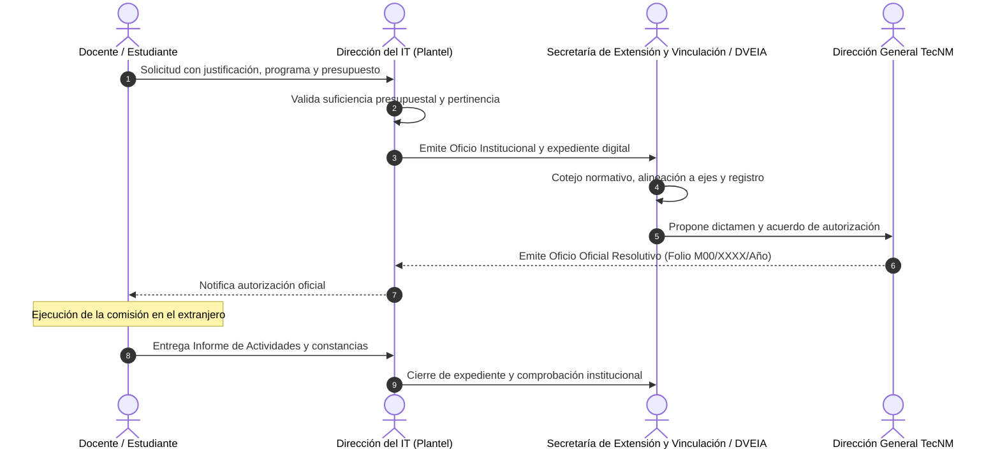

# Ficha Ejecutiva y Minuta de Preparación: Reunión de Avances

**Proyecto:** ATLAS TECNM (Plataforma de Indicadores y Gestión Institucional)  
**Proceso Asignado:** COMEXTRAS (Comisiones al Extranjero / Movilidad Internacional)  
**Equipo Responsable:** Célula de Desarrollo COMEXTRAS  
**Fecha de la Reunión:** Viernes (9:00 AM)  
**Carácter:** Documento Formal de Ingeniería y Gestión de Proyecto  

---

## Orden del Día: Respuestas y Avances Formales

```
┌─────────────────────────────────────────────────────────────────────────────┐
│                             AGENDA DE LA REUNIÓN                            │
├─────────────────────────────────────────────────────────────────────────────┤
│ 1. Avances en el análisis del proceso asignado y datos para el diseño de BD │
│ 2. Elección del logotipo institucional                                      │
│ 3. Inicio de la maquetación (Prototipo funcional / Frontend)                │
└─────────────────────────────────────────────────────────────────────────────┘
```

---

## Punto 1: Análisis del Proceso Asignado (COMEXTRAS) y Diseño de Base de Datos

### 1.1. Definición y Justificación Institucional
El proceso **COMEXTRAS** (Comisiones al Extranjero) es el procedimiento administrativo y normativo mediante el cual el personal docente y la comunidad estudiantil de los **263 Institutos Tecnológicos, Centros y Unidades del TecNM** gestionan la autorización oficial de la Dirección General para desarrollar actividades académicas, científicas, tecnológicas, deportivas o culturales fuera del país.

### 1.2. Documentación Oficial Analizada
Para garantizar el apego normativo, nuestro equipo analizó el acervo documental real:
1. **Circular 0045_COMEXTRAS** (Lineamientos vigentes emitidos por Dirección General).
2. **Manual de Procedimiento COMEXTRA** (Flujo de dictaminación, facultades y tiempos).
3. **Formatos de Solicitud 2026** (Guías de llenado para *Docentes* y *Estudiantes*).
4. **Formato Oficial Resolutivo de Autorización** (Estructura del Oficio definitivo con folio institucional `M00/XXXX/2026` y apercibimiento de austeridad).
5. **Base Histórica Nacional (`BASE COMEXTRAS 2026.xlsm` - 22 MB)**: Análisis de más de 30 campos de captura histórica consolidada.

### 1.3. Ciclo de Vida del Trámite (Flujo Funcional)



* **Estatus de la Comisión:** `Borrador` $\rightarrow$ `Preautorizada` $\rightarrow$ `Autorizada` $\rightarrow$ `No autorizada` / `Cancelada`.
* **Semáforo de Cumplimiento Post-Comisión:**
  * `Vigente`: Comisión en curso o dentro del plazo reglamentario para entregar informe.
  * `Vencida`: Periodo concluido sin informe de actividades registrado en la plataforma.

---

### 1.4. Diseño de Base de Datos para COMEXTRAS

Hemos estructurado la arquitectura de datos en dos niveles complementarios:

#### Nivel A: Modelo Data Mart (Ya implementado y en producción local)
* **Tabla `rep_registros_base`:**
  * Llaves dimensionales: `plantel_id`, `submodulo_id` (3.1), `periodo_id`, `user_id`.
  * Columnas generadas de integridad estricta en PostgreSQL (`STORED ALWAYS`):
    * `total_docentes` = `docentes_mujeres` + `docentes_hombres`
    * `total_estudiantes` = `estudiantes_mujeres` + `estudiantes_hombres`
    * `total_general` = sumatoria completa de los 4 cuadrantes.
  * Atributos semiestructurados en columna **`detalles_adicionales` (JSONB con índice GIN)** para capturar atributos dinámicos sin alterar esquemas rígidos.

#### Nivel B: Modelo Relacional Granular (Propuesta de profundización para COMEXTRAS)
Para la fase de seguimiento individualizado de expedientes, se propone la tabla transaccional `com_solicitudes`:

| Categoría de Datos | Campos / Atributos | Tipo de Dato | Propósito / Validación |
| :--- | :--- | :--- | :--- |
| **Folios y Registro** | `id`, `no_registro_nacional`, `oficio_plantel`, `oficio_tecnm_folio`, `trimestre_corte` | BIGINT, VARCHAR | Trazabilidad del folio institucional (`M00/XXXX/2026`). |
| **Origen Institucional** | `plantel_id`, `tipo_plantel` (Federal / Descentralizado), `director_nombre` | FK (cat_planteles) | Multi-tenancy por instituto tecnológico. |
| **Comisionado** | `nombre_completo`, `curp`, `rfc`, `sexo` (M/F), `tipo_persona` (Docente/Estudiante), `nivel_academico`, `carrera_o_area` | VARCHAR, ENUM | Padrón de participantes y analítica de género. |
| **Destino y Comisión** | `tipo_evento` (Congreso, Estancia, Competencia), `institucion_destino`, `ciudad_destino`, `pais_destino`, `continente` | VARCHAR | Cartografía de presencia internacional del TecNM. |
| **Temporalidad** | `fecha_solicitud`, `fecha_inicio`, `fecha_fin`, `dias_totales` | DATE, INTEGER | Cálculo de estancias y vigencias de reporte. |
| **Alineación Estratégica** | `categoria_impacto` (Agro, Semiconductores, Olinia, Salud, etc.), `justificacion` | ENUM, TEXT | Justificación del impacto nacional. |
| **Financiamiento** | `fuente_financiamiento` (Recursos Propios IT, TecNM Central, Invitante), `conceptos` | JSONB | Apego a directrices de austeridad presupuestal. |
| **Auditoría y Cierre** | `estatus_tramite`, `informe_entregado` (BOOLEAN), `url_expediente_digital`, `fecha_informe` | ENUM, VARCHAR | Cierre formal de expediente ante la DVEIA. |

---

## Punto 2: Elección del Logotipo Institucional

### 2.1. Posición del Equipo COMEXTRAS
* Se tiene entendido que el diseño y las propuestas gráficas del logotipo están asignadas al compañero o área responsable de diseño e identidad visual.
* **Nuestra aportación y preparación técnica:**
  * Toda la maquetación y arquitectura visual de ATLAS ya fue construida siguiendo de manera estricta el **Manual de Identidad Gráfica Oficial del TecNM 2026**:
    * **Azul TecNM Primario:** `#1B396A`
    * **Guinda Institucional:** `#9B2247`
    * **Oro / Dorado de Acento:** `#A57F2C`
    * **Verde Éxito:** `#1E5B4F`
    * **Tipografía Oficial:** Familia *Montserrat* / *Roboto*.
  * La plataforma se encuentra modularmente parametrizada para que, en cuanto el equipo elija el logotipo ganador, su integración en **Header, Login, Sidebar y Favicon** se ejecute de inmediato sin requerir refactorizaciones.

---

## Punto 3: Inicio de la Maquetación (Demostración de Avance Funcional)

Para este punto de la agenda, nuestro equipo no se limita a un boceto estático: **presentamos una maquetación viva, reactiva y navegable en Laravel 11 + Filament v3**.

### 3.1. Lo que ya está construido y listo para proyectar en la reunión:

1. **Tablero Directivo Nacional (Dashboard Nivel 1):**
   * **Bloque 1 (Pulso Nacional):**
     * Contador de días para el cierre trimestral (Q3 2026).
     * Semáforo institucional en tiempo real de los 263 planteles (**Publicados, Borrador, Rezagados**).
     * Barra de progreso de cobertura nacional y diagnóstico de paridad de género.
   * **Bloque 2 (Cartografía Interactiva y Despliegue Territorial):**
     * Mapa interactivo de la República Mexicana montado en **Leaflet.js** con capa base **ESRI ArcGIS Dark Canvas** y cartografía oficial de las 32 entidades.
     * Filtros cruzados dinámicos por submódulo (incluyendo **3.1 COMEXTRAS**) y sostenimiento (**Federal vs. Descentralizado**).
     * Tooltip reactivo al cursor y panel lateral con listado de institutos y semáforo local.
   * **Bloque 3 (Inclusión y Sectores Estratégicos):**
     * Ponderación de paridad estudiantil vs. docente.
     * Desglose porcentual de proyectos en sectores de impacto estratégico (Salud, TI, Agroindustria, Movilidad Internacional).

2. **Módulo de Captura COMEXTRAS (`ComextrasResource`):**
   * Vista de captura de solicitud formal con selector de periodos, planteles y estatus.
   * Cálculo en vivo (sin recargar la pantalla) de subtotales y total general por género.
   * Selector de modalidades COMEXTRAS (Movilidad Internacional, Deportiva, Cultural, Cívica).
   * Carga de expedientes y oficios en PDF/Excel con almacenamiento estructurado.

3. **Arquitectura Modular por Clusters:**
   * Navegación oficial organizada en los 4 Ejes del TecNM:
     * *Eje 1: Vinculación Estratégica*
     * *Eje 2: Innovación y Emprendimiento*
     * *Eje 3: Intercambio Académico (Hospeda a COMEXTRAS)*
     * *Eje 4: Extensión*

---

## Guion Rápido de Participación (Pitch para la Reunión)

* **Al tocar el Punto 1 (Análisis y BD):**
  > *"Por parte de COMEXTRAS, realizamos la revisión exhaustiva de la normativa institucional, de la circular 0045, de los formatos oficiales de solicitud de docentes y estudiantes, así como de la base histórica nacional de más de 20 megabytes. Tenemos mapeado el flujo de los 4 actores (plantel, DVEIA, Dirección General y comisionado) y el modelo de datos listo en dos capas: el Data Mart agregado ya funcional y la propuesta relacional transaccional para el control granular de cada expediente y oficio M00."*

* **Al tocar el Punto 2 (Logotipo):**
  > *"Sabemos que la propuesta creativa del logo la presenta el equipo de diseño. Por nuestra parte, queremos asegurar que el sistema ya está configurado con los colores y la tipografía exacta del Manual de Identidad TecNM 2026, por lo que cualquier propuesta aprobada se integrará en el sistema de manera transparente e inmediata."*

* **Al tocar el Punto 3 (Maquetación):**
  > *"Más que maquetas estáticas, queremos mostrarles el prototipo funcional operativo. Ya tenemos el Dashboard Directivo con mapa de la república interactivo, semáforo nacional de cumplimiento de los 263 tecnológicos, y la pantalla de captura del recurso 3.1 COMEXTRAS con validación de género en tiempo real."*
