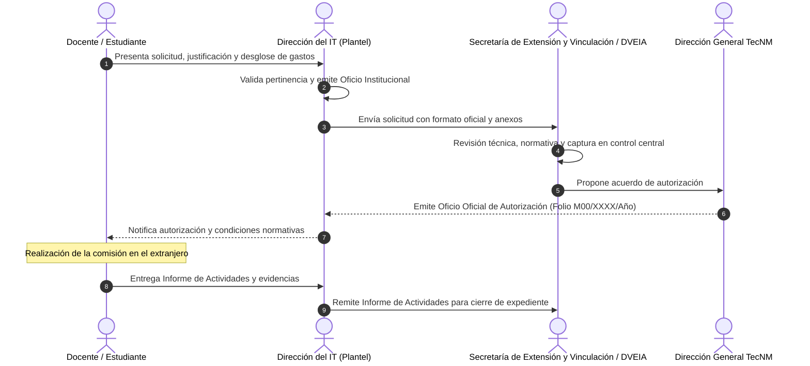

# Módulo COMEXTRA (Comisiones al Extranjero) — Documento de Definición y Flujo Funcional

## 1. Definición General
El submódulo **COMEXTRA** gestiona las **Comisiones al Extranjero** del **Tecnológico Nacional de México (TecNM)**. Es el procedimiento administrativo y normativo mediante el cual el personal docente y la comunidad estudiantil de los Institutos Tecnológicos (Federales y Descentralizados), Centros y Unidades del TecNM solicitan y obtienen la autorización institucional para realizar actividades oficiales fuera de México.

---

## 2. Actores y Niveles de Aprobación

### 2.1. Roles Principales
1. **Comisionado (Solicitante):**
   - **Docente:** Movilidad académica docente, visitas técnicas, estancias de investigación, ponencias en congresos, simposios, etc.
   - **Estudiante:** Movilidad académica estudiantil (Licenciatura, Maestría, Doctorado), estancias, competencias académicas, veranos científicos, residencias profesionales, actividades deportivas/culturales.
2. **Dirección del Instituto Tecnológico / Centro:**
   - Emite el oficio oficial de solicitud dirigido a Oficinas Centrales del TecNM.
   - Es responsable de verificar la suficiencia presupuestal y justificación cuando se empleen ingresos propios del plantel.
3. **Secretaría de Extensión y Vinculación & Dirección de Vinculación e Intercambio Académico (DVEIA):**
   - Órgano técnico central que valida la solicitud, revisa la alineación estratégica institucional y resguarda el expediente.
4. **Dirección General del TecNM:**
   - Autoridad facultada para emitir y firmar el oficio definitivo de autorización de la comisión al extranjero.

---

## 3. Ciclo de Vida del Trámite

1. **Recepción y Registro de Solicitud:**
   - El plantel envía el oficio formal y el formato estandarizado (`FORMATO DE SOLICITUD DE COMEXTRA`).
   - Se registran datos generales, fechas del evento y comisionado(s).
2. **Dictaminación y Estatus:**
   - Los posibles estatus de la comisión son:
     - `Preautorizada`
     - `Autorizada`
     - `No autorizada`
     - `Cancelada`
3. **Emisión de Oficio Resolutivo:**
   - Si es autorizada, se genera el oficio formal con folio oficial TecNM (ej. `M00/00697/2026`).
   - El oficio apercibe al plantel y comisionado sobre el apego a los lineamientos de austeridad en el gasto público federal.
4. **Monitoreo de Expediente y Cierre Post-Comisión:**
   - **Entrega de Informe de Actividades:** Al concluir la comisión, el comisionado tiene la obligación reglamentaria de entregar un informe con evidencias fotográficas y académicas.
   - **Control de Vigencia:**
     - `Vigente`: La comisión está en curso o en tiempo de entrega de reporte.
     - `Vencido`: El periodo de comisión concluyó y no se ha registrado la entrega del informe final.

---

## 4. Estructura de Datos (Campos Clave para ATLAS)

A partir del análisis de la base de datos nacional (`BASE COMEXTRAS 2026.xlsm`), los campos indispensables para el módulo son:

| Grupo de Datos | Atributos Principales | Descripción / Observaciones |
| :--- | :--- | :--- |
| **Identificación & Folios** | `no_registro`, `oficio_solicitud_it`, `fecha_oficio_solicitud`, `oficio_respuesta_tecnm`, `trimestre_cia` | Folio interno del plantel y número de oficio nacional TecNM. Control trimestral de comisiones. |
| **Plantel / Ubicación** | `instituto_tecnologico_id`, `estado`, `region`, `tipo_plantel` (Federal / Descentralizado), `director_nombre` | Identificación institucional del tecnológico de origen. |
| **Comisionado** | `nombre_comisionado`, `sexo` (H/M), `tipo_persona` (Docente / Estudiante), `nivel_academico` (Licenciatura, Maestría, Doctorado), `carrera_o_area` | Perfil del participante comisionado. |
| **Detalles del Evento** | `tipo_movilidad`, `tipo_evento`, `tipo_participacion`, `institucion_destino`, `ciudad_destino`, `pais_destino` | Congreso, simposio, estancia, competencia, residencia profesional, etc. |
| **Temporalidad** | `fecha_solicitud`, `fecha_tramite`, `fecha_respuesta_dg`, `fecha_inicio_comision`, `fecha_fin_comision`, `dias_totales_comision` | Tiempos de trámite del TecNM y duración de la estancia. |
| **Alineación e Impacto** | `justificacion`, `categoria_impacto` | Ejes: *Agroalimentario, Electromovilidad y ciudades inteligentes, Cambio climático, Industrias creativas, Servicios para la salud, Deportiva/Cultural*. |
| **Financiamiento** | `fuente_financiamiento`, `conceptos_financiados` (Alimentación, Hospedaje, Transporte, Trámites) | TecNM, Recursos propios del comisionado, Institución invitante, CONAHCYT. |
| **Seguimiento y Auditoría** | `estatus_autorizacion`, `tipo_expediente` (Físico, Digital, Ambos), `entrega_informe` (Sí/No), `url_informe_actividades`, `vigencia` (Vigente / Vencido) | Control de cumplimiento y entrega de comprobación. |

---

## 5. Valor para el Sistema ATLAS (Oportunidades de Automatización)

1. **Digitalización integral del flujo:** Sustituir la captura en hojas de cálculo compartidas por una plataforma web segura con roles para tecnológicos y oficinas centrales.
2. **Generación automática del Oficio:** Plantilla dinámica para emitir en segundos el oficio en formato PDF con firma electrónica y código QR de validación.
3. **Semáforo y Alertas de Comisiones Vencidas:** Notificaciones automáticas a los tecnológicos cuando un docente o estudiante no haya subido su informe de actividades dentro del plazo posterior a su regreso.
4. **Analítica Directiva y Tableros:**
   - Mapa interactivo de presencia internacional del TecNM por países y continentes.
   - Indicadores de género y distribución docente vs. estudiantil.
   - Desglose por sectores estratégicos nacionales (Olinia, semiconductores, agroindustria, salud).
