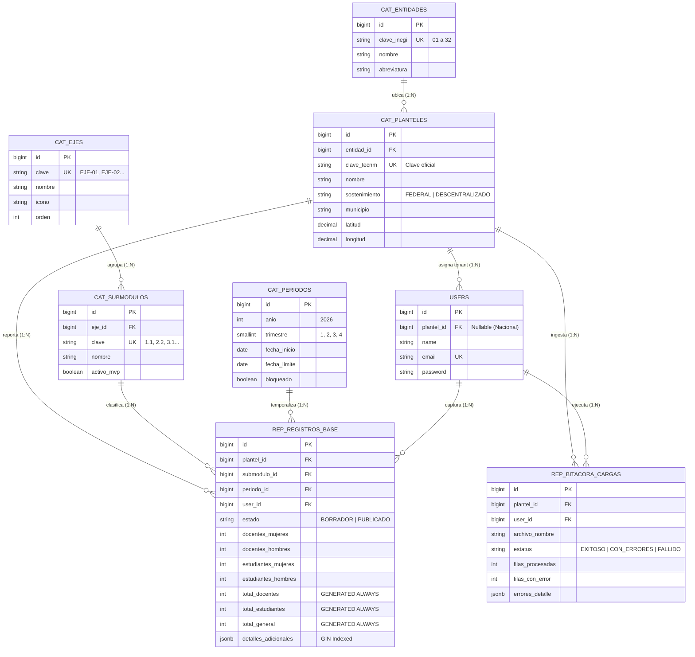

# Especificación Técnica de Base de Datos: ATLAS TECNM

**Proyecto:** ATLAS TECNM  
**Motor:** PostgreSQL 16 (Alojado en Neon Serverless)  
**ORM / Migraciones:** Laravel 11 Database Migrations  
**Estatus:** Arquitectura Técnica Aprobada  

---

## 1. Fundamentos y Decisiones de Ingeniería de Datos

El diseño de la base de datos de **ATLAS TECNM** responde a las particularidades de negocio del TecNM:

1. **Volumen Ligero y Altamente Estructurado:**
   * 263 planteles reportando en 4 cortes trimestrales generan en promedio entre 2,000 y 10,000 registros por año.
   * Se descarta el uso de bases NoSQL (como MongoDB) ya que las relaciones entre entidad federativa, plantel, periodo y submódulo son estrictamente relacionales.
2. **Esquema Estrella con Extensión JSONB (Híbrido Relacional/Documental):**
   * Las dimensiones maestras (`cat_ejes`, `cat_submodulos`, `cat_entidades`, `cat_planteles`, `cat_periodos`) proporcionan integridad referencial rígida y normalizada.
   * La tabla de hechos central (`rep_registros_base`) almacena las métricas cuantitativas estándar (docentes y alumnos por género) y delega campos variables específicos a una columna `JSONB` indexada con **GIN**, evitando migraciones continuas para cada uno de los 35 submódulos.
3. **Cálculo Determinista en Motor (`STORED GENERATED COLUMNS`):**
   * Se eliminan las inconsistencias matemáticas humanas provenientes de las hojas de cálculo trasladando las sumatorias al motor PostgreSQL:
     $$\text{total\_general} = \text{docentes\_mujeres} + \text{docentes\_hombres} + \text{estudiantes\_mujeres} + \text{estudiantes\_hombres}$$
   * El cálculo se almacena físicamente al insertar o actualizar (`STORED`), haciendo que las consultas de agregación y reportes corran a velocidad nativa sin sobrecargar la CPU en tiempo de lectura.
4. **Resiliencia Serverless en Neon (Connection Pooling):**
   * Neon suspende computos inactivos y limita conexiones directas. Para soportar picos concurrentes durante los cierres de trimestre, la aplicación Laravel se conectará a través del **PgBouncer Connection Pooler** de Neon (puerto `6543`).

---

## 2. Diagrama Entidad-Relación (ERD)



---

## 3. Diccionario de Datos y Especificación de Migraciones (DDL)

### 3.1. `cat_ejes` (Ejes Estratégicos Institucionales)
Almacena los 4 ejes rectores del TecNM.

```sql
CREATE TABLE cat_ejes (
    id BIGSERIAL PRIMARY KEY,
    clave VARCHAR(10) NOT NULL UNIQUE,       -- 'EJE-01', 'EJE-02', 'EJE-03', 'EJE-04'
    nombre VARCHAR(150) NOT NULL,            -- 'Innovación y Emprendimiento'
    icono VARCHAR(50) NULL,                  -- Identificador del icono para Filament
    orden SMALLINT NOT NULL DEFAULT 1,
    created_at TIMESTAMP WITH TIME ZONE DEFAULT CURRENT_TIMESTAMP,
    updated_at TIMESTAMP WITH TIME ZONE DEFAULT CURRENT_TIMESTAMP
);
```

### 3.2. `cat_submodulos` (Los 35 Submódulos Institucionales)
Registra el universo completo de submódulos oficiales.

```sql
CREATE TABLE cat_submodulos (
    id BIGSERIAL PRIMARY KEY,
    eje_id BIGINT NOT NULL REFERENCES cat_ejes(id) ON DELETE CASCADE,
    clave VARCHAR(10) NOT NULL UNIQUE,       -- '2.2', '3.1', etc.
    nombre VARCHAR(200) NOT NULL,            -- 'Modelo Talento Emprendedor'
    descripcion TEXT NULL,
    activo_mvp BOOLEAN NOT NULL DEFAULT FALSE, -- TRUE únicamente para 2.2 y 3.1
    created_at TIMESTAMP WITH TIME ZONE DEFAULT CURRENT_TIMESTAMP,
    updated_at TIMESTAMP WITH TIME ZONE DEFAULT CURRENT_TIMESTAMP
);

CREATE INDEX idx_submodulos_eje ON cat_submodulos(eje_id);
CREATE INDEX idx_submodulos_activo ON cat_submodulos(activo_mvp);
```

### 3.3. `cat_entidades` (Estados de la República Mexicana)
Contiene las 32 entidades federativas mapeadas al estándar INEGI para compatibilidad con GeoJSON y ECharts.

```sql
CREATE TABLE cat_entidades (
    id BIGSERIAL PRIMARY KEY,
    clave_inegi CHAR(2) NOT NULL UNIQUE,     -- '01' (Aguascalientes) a '32' (Zacatecas)
    nombre VARCHAR(50) NOT NULL,
    abreviatura VARCHAR(10) NOT NULL,
    created_at TIMESTAMP WITH TIME ZONE DEFAULT CURRENT_TIMESTAMP,
    updated_at TIMESTAMP WITH TIME ZONE DEFAULT CURRENT_TIMESTAMP
);
```

### 3.4. `cat_planteles` (Catálogo Maestro de los 263 Institutos)
Sustento del Multi-Tenancy y del análisis comparativo institucional.

```sql
CREATE TYPE tipo_sostenimiento AS ENUM ('FEDERAL', 'DESCENTRALIZADO');

CREATE TABLE cat_planteles (
    id BIGSERIAL PRIMARY KEY,
    entidad_id BIGINT NOT NULL REFERENCES cat_entidades(id) ON DELETE RESTRICT,
    clave_tecnm VARCHAR(20) NOT NULL UNIQUE, -- Clave oficial del instituto
    nombre VARCHAR(180) NOT NULL,            -- 'Instituto Tecnológico de Puebla'
    municipio VARCHAR(100) NOT NULL,
    sostenimiento tipo_sostenimiento NOT NULL DEFAULT 'FEDERAL',
    latitud NUMERIC(10, 7) NULL,             -- Para geolocalización en mapas
    longitud NUMERIC(10, 7) NULL,
    activo BOOLEAN NOT NULL DEFAULT TRUE,
    created_at TIMESTAMP WITH TIME ZONE DEFAULT CURRENT_TIMESTAMP,
    updated_at TIMESTAMP WITH TIME ZONE DEFAULT CURRENT_TIMESTAMP
);

CREATE INDEX idx_planteles_entidad ON cat_planteles(entidad_id);
CREATE INDEX idx_planteles_sostenimiento ON cat_planteles(sostenimiento);
```

### 3.5. `cat_periodos` (Control de Cortes Trimestrales)
Administra los periodos de captura y activa el congelamiento de datos para el Semáforo de Cumplimiento.

```sql
CREATE TABLE cat_periodos (
    id BIGSERIAL PRIMARY KEY,
    anio SMALLINT NOT NULL,                  -- 2026
    trimestre SMALLINT NOT NULL CHECK (trimestre BETWEEN 1 AND 4),
    fecha_inicio DATE NOT NULL,
    fecha_limite DATE NOT NULL,
    bloqueado BOOLEAN NOT NULL DEFAULT FALSE, -- Si es TRUE, no permite altas/modificaciones
    created_at TIMESTAMP WITH TIME ZONE DEFAULT CURRENT_TIMESTAMP,
    updated_at TIMESTAMP WITH TIME ZONE DEFAULT CURRENT_TIMESTAMP,
    CONSTRAINT uq_anio_trimestre UNIQUE (anio, trimestre)
);
```

### 3.6. `users` (Usuarios y Tenancy)
Soporta tanto a usuarios asignados a un plantel específico (operadores locales) como a directivos nacionales (visión global).

```sql
CREATE TABLE users (
    id BIGSERIAL PRIMARY KEY,
    plantel_id BIGINT NULL REFERENCES cat_planteles(id) ON DELETE SET NULL,
    name VARCHAR(255) NOT NULL,
    email VARCHAR(255) NOT NULL UNIQUE,
    email_verified_at TIMESTAMP NULL,
    password VARCHAR(255) NOT NULL,
    remember_token VARCHAR(100) NULL,
    created_at TIMESTAMP WITH TIME ZONE DEFAULT CURRENT_TIMESTAMP,
    updated_at TIMESTAMP WITH TIME ZONE DEFAULT CURRENT_TIMESTAMP
);

CREATE INDEX idx_users_plantel ON users(plantel_id);
```

### 3.7. `rep_registros_base` (Tabla de Hechos Central)
La tabla neurálgica de **ATLAS TECNM** donde se consolidan las métricas de todos los submódulos.

```sql
CREATE TYPE estado_reporte_enum AS ENUM ('BORRADOR', 'PUBLICADO');

CREATE TABLE rep_registros_base (
    id BIGSERIAL PRIMARY KEY,
    plantel_id BIGINT NOT NULL REFERENCES cat_planteles(id) ON DELETE RESTRICT,
    submodulo_id BIGINT NOT NULL REFERENCES cat_submodulos(id) ON DELETE RESTRICT,
    periodo_id BIGINT NOT NULL REFERENCES cat_periodos(id) ON DELETE RESTRICT,
    user_id BIGINT NOT NULL REFERENCES users(id) ON DELETE RESTRICT,
    
    estado estado_reporte_enum NOT NULL DEFAULT 'BORRADOR',

    -- Métricas cuantitativas estándar (docentes y alumnos)
    docentes_mujeres INTEGER NOT NULL DEFAULT 0 CHECK (docentes_mujeres >= 0),
    docentes_hombres INTEGER NOT NULL DEFAULT 0 CHECK (docentes_hombres >= 0),
    estudiantes_mujeres INTEGER NOT NULL DEFAULT 0 CHECK (estudiantes_mujeres >= 0),
    estudiantes_hombres INTEGER NOT NULL DEFAULT 0 CHECK (estudiantes_hombres >= 0),

    -- Columnas generadas STORED: el motor calcula y persiste automáticamente
    total_docentes INTEGER GENERATED ALWAYS AS (docentes_mujeres + docentes_hombres) STORED,
    total_estudiantes INTEGER GENERATED ALWAYS AS (estudiantes_mujeres + estudiantes_hombres) STORED,
    total_general INTEGER GENERATED ALWAYS AS (
        docentes_mujeres + docentes_hombres + estudiantes_mujeres + estudiantes_hombres
    ) STORED,

    -- Payload semiestructurado para atributos específicos de cada submódulo
    detalles_adicionales JSONB NOT NULL DEFAULT '{}'::jsonb,

    created_at TIMESTAMP WITH TIME ZONE DEFAULT CURRENT_TIMESTAMP,
    updated_at TIMESTAMP WITH TIME ZONE DEFAULT CURRENT_TIMESTAMP,

    -- Unicidad estricta: Un plantel solo reporta una vez un submódulo por trimestre
    CONSTRAINT uq_plantel_submodulo_periodo UNIQUE (plantel_id, submodulo_id, periodo_id)
);

-- Índices de alto rendimiento
CREATE INDEX idx_rep_plantel_periodo ON rep_registros_base(plantel_id, periodo_id);
CREATE INDEX idx_rep_submodulo_periodo ON rep_registros_base(submodulo_id, periodo_id);
CREATE INDEX idx_rep_estado ON rep_registros_base(estado);

-- Índice GIN para búsquedas y agregaciones sobre el campo JSONB
CREATE INDEX idx_rep_detalles_gin ON rep_registros_base USING gin (detalles_adicionales);
```

### 3.8. `rep_bitacora_cargas` (Auditoría de Ingesta Asíncrona Excel)
Registra las cargas masivas realizadas por plantel, facilitando el diagnóstico de errores.

```sql
CREATE TYPE estatus_carga_enum AS ENUM ('PROCESANDO', 'EXITOSO', 'CON_ERRORES', 'FALLIDO');

CREATE TABLE rep_bitacora_cargas (
    id BIGSERIAL PRIMARY KEY,
    plantel_id BIGINT NOT NULL REFERENCES cat_planteles(id) ON DELETE CASCADE,
    user_id BIGINT NOT NULL REFERENCES users(id) ON DELETE CASCADE,
    submodulo_id BIGINT NOT NULL REFERENCES cat_submodulos(id) ON DELETE CASCADE,
    periodo_id BIGINT NOT NULL REFERENCES cat_periodos(id) ON DELETE CASCADE,
    archivo_nombre VARCHAR(255) NOT NULL,
    estatus estatus_carga_enum NOT NULL DEFAULT 'PROCESANDO',
    filas_procesadas INTEGER NOT NULL DEFAULT 0,
    filas_con_error INTEGER NOT NULL DEFAULT 0,
    errores_detalle JSONB NOT NULL DEFAULT '[]'::jsonb,
    created_at TIMESTAMP WITH TIME ZONE DEFAULT CURRENT_TIMESTAMP,
    updated_at TIMESTAMP WITH TIME ZONE DEFAULT CURRENT_TIMESTAMP
);
```

---

## 4. Implementación en Laravel 11 Migrations

A continuación se muestra el código canónico de la migración principal de la tabla de hechos para Laravel 11:

```php
<?php

use Illuminate\Database\Migrations\Migration;
use Illuminate\Database\Schema\Blueprint;
use Illuminate\Support\Facades\Schema;

return new class extends Migration
{
    public function up(): void
    {
        Schema::create('rep_registros_base', function (Blueprint $table) {
            $table->id();
            $table->foreignId('plantel_id')->constrained('cat_planteles')->restrictOnDelete();
            $table->foreignId('submodulo_id')->constrained('cat_submodulos')->restrictOnDelete();
            $table->foreignId('periodo_id')->constrained('cat_periodos')->restrictOnDelete();
            $table->foreignId('user_id')->constrained('users')->restrictOnDelete();
            
            $table->enum('estado', ['BORRADOR', 'PUBLICADO'])->default('BORRADOR');

            $table->unsignedInteger('docentes_mujeres')->default(0);
            $table->unsignedInteger('docentes_hombres')->default(0);
            $table->unsignedInteger('estudiantes_mujeres')->default(0);
            $table->unsignedInteger('estudiantes_hombres')->default(0);

            // Columnas Generadas STORED nativas en Laravel
            $table->storedAs('total_docentes', 'docentes_mujeres + docentes_hombres');
            $table->storedAs('total_estudiantes', 'estudiantes_mujeres + estudiantes_hombres');
            $table->storedAs('total_general', 'docentes_mujeres + docentes_hombres + estudiantes_mujeres + estudiantes_hombres');

            $table->jsonb('detalles_adicionales')->default('{}');

            $table->timestamps();

            // Restricción única y llaves compuestas
            $table->unique(['plantel_id', 'submodulo_id', 'periodo_id'], 'uq_plantel_submod_periodo');
            $table->index(['plantel_id', 'periodo_id']);
            $table->index(['submodulo_id', 'periodo_id']);
            $table->index('estado');
        });

        // Creación del índice GIN para PostgreSQL
        DB::statement('CREATE INDEX idx_rep_detalles_gin ON rep_registros_base USING gin (detalles_adicionales);');
    }

    public function down(): void
    {
        Schema::dropIfExists('rep_registros_base');
    }
};
```

---

## 5. Estrategia de Seeders (Población Inicial)

Para que el sistema sea funcional inmediatamente tras ejecutar `php artisan migrate --seed`:

1. **`EjesSeeder`:** Inserta los 4 ejes institucionales (`EJE-01` a `EJE-04`) con sus iconos y orden.
2. **`SubmodulosSeeder`:** Inserta los 35 submódulos institucionales. Marca con `activo_mvp = true` únicamente a `2.2` (MTE) y `3.1` (Movilidad/COMEXTRAS); el resto con `false`.
3. **`EntidadesSeeder`:** Inserta las 32 entidades federativas con clave INEGI (`01` a `32`).
4. **`PlantelesSeeder`:** Procesa el catálogo maestro de los 263 institutos con clave TecNM, nombre, municipio, tipo de sostenimiento y coordenadas lat/long.
5. **`PeriodosSeeder`:** Crea los 4 trimestres del año en curso (2026: Q1 a Q4) con fechas de inicio y límite.
6. **`ShieldSeeder` / `RolesSeeder`:** Genera los 6 roles de la matriz (`R1` a `R6`) y crea el usuario inicial `Super Administrador`.

---

## 6. Configuración de Alta Disponibilidad en Neon Serverless

Para prevenir errores de conexión agotada durante el periodo de cierre trimestral:

1. **Endpoint con Connection Pooling (`.env`):**
   ```env
   DB_CONNECTION=pgsql
   DB_HOST=ep-example-pooler.us-east-2.aws.neon.tech
   DB_PORT=6543
   DB_DATABASE=neondb
   DB_USERNAME=neondb_owner
   DB_PASSWORD=********
   DB_SSLMODE=require
   ```
2. **Direct Connection para Migraciones:**
   * Las migraciones que alteran tipos `ENUM` o sentencias DDL complejas se ejecutan preferentemente sobre el puerto nativo `5432` (`direct`), mientras que el tráfico web de la aplicación corre sobre el puerto `6543` (`pooler`).
